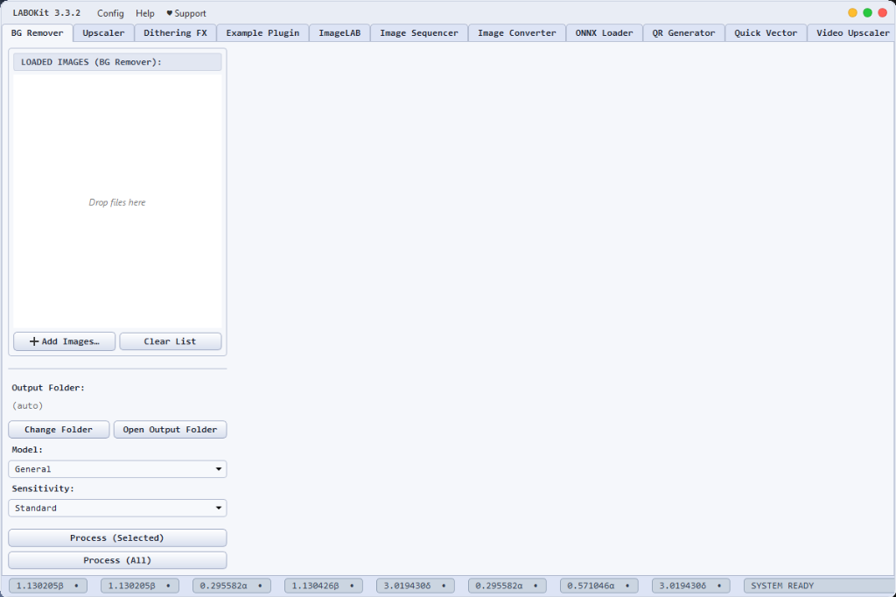

<div align="center">

# LABOKit 3.3.2 Stable - Coming Soon


<p align="center">
  <a href="https://github.com/wagakano/LABOKit/releases/latest"></a>
  <a href="https://github.com/wagakano/LABOKit/blob/main/LICENSE"></a>
  <a href="https://github.com/wagakano/LABOKit/stargazers"></a>
  <a href="https://github.com/wagakano/LABOKit/releases"></a>
</p>

LABOKit is a modular desktop tool for offline batch image processing. Built with Python and PySide6, it gives you a clean interface for background removal, upscaling, image sequencing, dithering, vectorization, and custom image editing.

*El Psy Kongroo.*

</div>

---

> [!NOTE]  
> LABOKit 3.3.2 is currently in its final testing phase to ensure we deliver the most reliable experience possible before launch.

<div align="center">
  
</div>

## What's New in LABOKit 3.3.2 Stable (Coming Soon)

- **Theme Engine**: Dynamic Light and Dark Mode theme engine with persistent state storage in settings.
- **Native Window Resizability**: Resizable main window with titlebar toggle, Maximize control, and border dragging.
- **Glitch-Free Upscaling**: High-quality Lanczos downsampling for 2x and 3x upscales without Vulkan texture artifacts.
- **Performance Boosts**: O(K) callback state loop optimizations eliminating main-thread UI freezes during large batch processing.
- **UI & Accessibility Polish**: Standardized styling, tooltips, and screen-reader accessibility across all core tabs and plugins.

---

## Changelog 3.3.2

### Theme Engine & Full UI Harmonization
- **Light & Dark Theme Engine**: Introduced a dynamic theme engine with persistent theme state storage.
- **Menu Popup Styling Fix**: Fixed transparent QMenu dropdown popups in QMenuBar across both light and dark themes.
- **Universal Component Styling**: Standardized list box containers, scrollbars, frame borders, and buttons universally across core tabs and plugins.
- **ImageLAB Checkbox Fix**: Fixed invisible checkbox labels in light mode by adding explicit QCheckBox text and indicator CSS rules.

### Window Mechanics & Resizability
- **Native Resizing & Maximize Controls**: Made the custom frameless main window resizable with native Windows border dragging, double-click titlebar toggling, and dedicated Maximize/Restore controls.
- **Rounded Border Insets**: Added 1px margin offsets on the main frame to prevent window mask clipping on rounded corners.

### Performance & Speed Optimizations
- **O(K) Callback State Loop**: Reduced post-processing main-thread disk I/O in on_worker_finished from O(N) full list scanning down to O(K) processed subset scanning, preventing UI lockups when handling thousands of files.
- **Numba JIT Bundling**: Restored numba in PyInstaller build specifications, enabling C-speed execution for matrix and dithering math.

### Stability & Engine Reliability
- **PyInstaller EBADF Crash Fix**: Resolved windowed mode (--noconsole) startup crashes by implementing global SafeStream stdout/stderr redirection.
- **Event Starvation Throttling**: Throttled Divergence Meter status spinner updates to prevent Qt event loop starvation during intensive background runs.
- **Atomic Model Asset Deployment**: Implemented atomic temporary file copying (.tmp_copy -> .onnx) on app startup to prevent AI engines from reading partially copied model files.
- **Instant Progress Feedback**: Progress dialogs now immediately display status updates ("Loading model...") before loading heavy AI engines.

### Upscaler Improvements
- **Multi-Path Model Detection**: Updated init_upsampler to check internal bundle directories as fallbacks, resolving "Failed to initialize upsampler" errors for realesr-general-x4v3.pth.
- **Glitch-Free 2x & 3x Scaling**: Fixed Vulkan GPU downsampling texture glitches on 2x/3x scale requests by running native 4x model inference followed by high-quality CPU Lanczos post-resampling.

### Models, Plugins & Accessibility
- **Model Restorations**: Restored pre-packaged offline weights for "Performance" (u2netp) and "Human Portrait" (silueta) background remover models.
- **Example Plugin**: Added plugins/ExamplePlugin.kit and updated developer guidelines.
- **Micro-UX & Accessibility**: Added tooltips and screen-reader labels to FileDropListWidget, SplitImageLabel, split-view toggle buttons, and zoom sliders.

---

## Features

- **Batch Background Removal:** Powered by `rembg`.
- **Batch Upscaling:** Supports GPU (Real-ESRGAN Vulkan) and CPU (PyTorch).
- **ImageLAB:** Built-in editor for creative filters, ASCII art, pixel adjustments, and glitches.
- **Image Sequencer:** Convert image frames into animated GIFs or MP4 videos.
- **Plugin System:** Add new tools with `.kit` plugin modules.
- **Offline & Private:** Runs entirely on your computer — no data leaves your machine.
- **Multilanguage Support:** Supports English, Japanese, Indonesian, Chinese, Korean, Spanish, French, German, and more.

---

## Download LABOKit 3.3.2 Stable (Coming Soon)

### Windows
1. Download the installer: **[LABOKit_v3.3.2_Setup.exe](https://github.com/wagakano/LABOKit/releases/download/v3.3.2/LABOKit_v3.3.2_Setup.exe)**
2. Run `LABOKit_v3.3.2_Setup.exe` to install.

### Linux
Source code and Linux build instructions are on the [main_linux branch](https://github.com/wagakano/LABOKit/tree/main_linux).

### Alternative UI (Electron Version)
Contributed by **[Chizuu](https://github.com/Chizuui)**:
- **[LABOKit Electron v1.3 Repository](https://github.com/Chizuui/labokit-electron)**

---

## Plugins & Downloads

LABOKit features can be extended using `.kit` plugins. You can download `.kit` files directly below or update them in the app via **Config** > **Check for Plugin Updates**.

### Installing Plugins (.kit)
1. Open **LABOKit**.
2. Go to **Config** > **Load Plugin (.kit)...**
3. Choose the `.kit` file to install.
4. *(To remove a plugin, delete its `.kit` file in **Config** > **Open Plugins Folder**)*.

### Available Plugins Download List

| Plugin Name | Type | Description | Download |
| :--- | :---: | :--- | :---: |
| **Video Upscaler** | Free | Upscale video files frame-by-frame using Real-ESRGAN and FFmpeg. | [`VideoUpscaler.kit`](https://github.com/wagakano/LABOKit-assets/releases/download/update2/VideoUpscaler.kit) |
| **ONNX Loader** | Free | Load custom `.onnx` upscaler models directly into LABOKit. | [`ONNXLoader.kit`](https://github.com/wagakano/LABOKit-assets/releases/download/update2/ONNXLoader.kit) |
| **QR Code Generator** | Free | Batch generate single or multi-line QR codes into PNG images. | [`QRCodeGenerator.kit`](https://github.com/wagakano/LABOKit-assets/releases/download/update2/QRCodeGenerator.kit) |
| **Watermark Remover** | Free | Remove watermarks with brush masking powered by LaMa ONNX. | [`WatermarkRemover.kit`](https://github.com/wagakano/LABOKit-assets/releases/download/update2/WatermarkRemover.kit) |
| **Quick Vector** | Advanced | Convert raster images (PNG, JPG, BMP) into SVG vector files. | Supporters Only |
| **Dithering FX** | Advanced | Retro pixel dithering, custom color palettes, and GIF animations. | Supporters Only |
| **Image Converter** | Advanced | Batch convert WebP, JPG, PNG, ICO, and BMP formats with transparency handling. | Supporters Only |

---

## 💖 Support & Rewards

If you enjoy using LABOKit and want to support ongoing development, consider donating to unlock Advanced Plugins (`Quick Vector`, `Dithering FX`, `Image Converter`):

<p align="left">
  <a href="https://ko-fi.com/s/a367e473fe"></a>
  <a href="https://trakteer.id/kano-bbif7/reward/labokit-advanced-plugins-m84J6"></a>
</p>

---

## Project Structure

```
LABOKit/
├── main.py                 # Main entry point, window, plugin loader, update checker
├── core_config.py          # Shared paths, constants, lazy AI engine loader
├── bg_remover_tab.py       # Background Remover tab & worker thread
├── upscaler_tab.py         # Upscaler tab & worker thread (Vulkan + PyTorch)
├── ui_shared.py            # Reusable UI components (FileDropListWidget, ZoomableImageWidget, etc.)
├── translations.py         # Translation dictionary & helper functions
├── latest_version.json     # Version metadata for in-app update checker
├── plugins_manifest.json   # Plugin registry with versions & download URLs
├── LABOKit_Installer.iss   # Inno Setup installer script
├── splash.png              # Splash screen image
├── labokit.ico             # Application icon
│
├── plugins/                # .kit plugin files
│   ├── ImageLAB.kit        # Creative effects, ASCII art, glitches
│   ├── ImageSequencer.kit  # GIF & MP4 sequence compiler
│   └── ...                 # Additional downloadable plugins
│
├── models/                 # AI model weights
├── ffmpeg/                 # Bundled ffmpeg executable
├── realesrgan_ncnn/        # Real-ESRGAN Vulkan executable & models
└── scratch/                # Utility scripts
```

---

## Running from Source

1. **Clone the repository:**
   ```bash
   git clone https://github.com/wagakano/LABOKit.git
   cd LABOKit
   git checkout main_windows
   ```

2. **Create and activate a virtual environment:**
   ```bash
   python -m venv .venv
   .venv\Scripts\activate
   ```

3. **Install dependencies:**
   ```bash
   pip install -r requirements.txt
   ```

4. **Run the application:**
   ```bash
   python main.py
   ```

---

## Building

### Standalone Executable
```bash
.venv\Scripts\pyinstaller LABOKit.spec
```

### Windows Installer
Requires Inno Setup 6:
```bash
"C:\Program Files (x86)\Inno Setup 6\ISCC.exe" LABOKit_Installer.iss
```

---

## Plugin Development

Plugins are Python modules saved with a `.kit` extension. They are loaded dynamically at startup from `%APPDATA%/LABOKit/plugins/`.

A complete reference implementation is available in [plugins/ExamplePlugin.kit](file:///c:/Users/shira/Projects/LABOKit/plugins/ExamplePlugin.kit), showcasing custom plugin creation with asynchronous worker threads (`QThread`), translation hooks, and theme integration.

### Plugin Template

```python
# LABOKit Plugin: My Plugin
# ID: labokit.my_plugin

from PySide6.QtWidgets import QWidget, QVBoxLayout, QLabel

PLUGIN_ID = "labokit.my_plugin"
PLUGIN_NAME = "My Plugin"
PLUGIN_VERSION = "1.0"

HELP_TEXT = "<h3>My Plugin</h3><p>Description here.</p>"

def create_tab(ctx=None):
    tab = QWidget()
    layout = QVBoxLayout(tab)
    layout.addWidget(QLabel("Hello from My Plugin!"))
    return tab
```

---

## License & Credits

This project is licensed under the [MIT License](LICENSE).
See [LABOKit_NOTICE.txt](LABOKit_NOTICE.txt) for license details regarding bundled third-party libraries.
